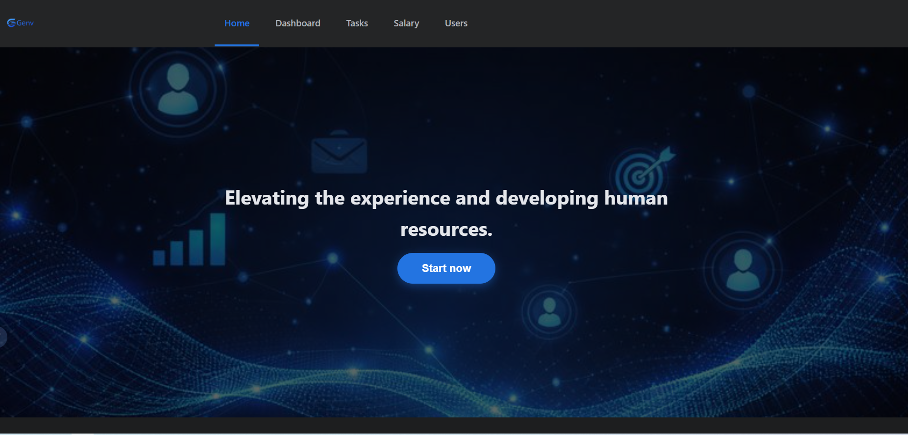
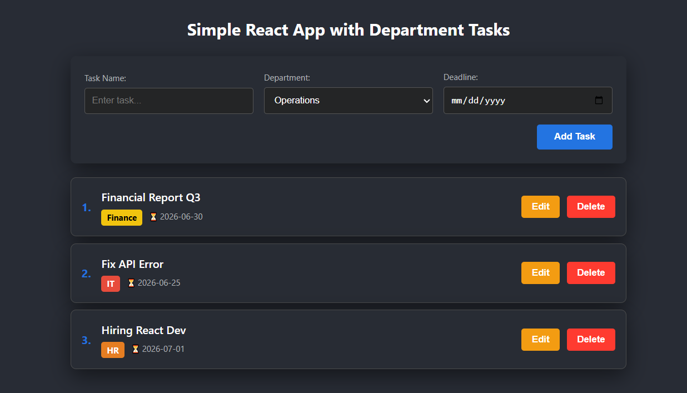
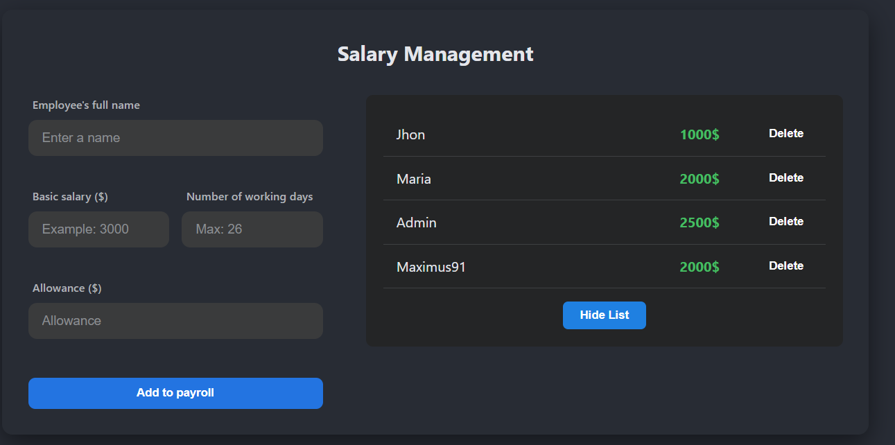
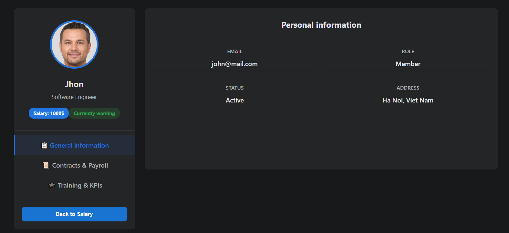

# GENV - Human Resources Management System

> **GENV** is a modern Employee Experience Management platform built with ReactJS. It helps businesses manage tasks, personnel, and salaries efficiently through an intuitive Dark Mode interface.

## Screenshots

| **Home Page** | **Task Manager** |
|:---:|:---:|
|  |  |
| *Modern Landing Page* | *Department & Deadline Tracking* |

| **Salary Management** | **User Details** |
|:---:|:---:|
|  |  |
| *Payroll CRUD Operations* | *Employee Profiles* |

## Features

### 1. Modern UI/UX
- Responsive Navigation Bar with active states.
- Consistent **Dark Mode** theme across the application.
- Professional landing page with engaging CTA.

### 2. Advanced Task Manager (Todo List)
- **Add Tasks:** Input task name, select **Department** (IT, Marketing, Finance, etc.), and set **Deadlines**.
- **Visual Badges:** Tasks are color-coded by department for quick identification.
- **Management:** Edit and Delete tasks instantly.

### 3. Salary Management
- Manage employee payrolls efficiently.
- Add new records with Name, Salary, and Allowance.
- Real-time list updates and deletion capabilities.

### 4. User Management
- List view of all employees.
- Detailed profile view for individual employees (Avatar, Email, Job Title).

## 🛠 Tech Stack

- **Core:** ReactJS (Class Components), HTML5, CSS3.
- **Styling:** SCSS (Sass) for nested styling and variables.
- **Routing:** React Router DOM (Single Page Application navigation).
- **Notifications:** React Toastify (User feedback alerts).
- **State Management:** React State / Props.

## Installation & Run

Clone the project and install dependencies:

# Clone the repository
git clone [https://github.com/g3nval/reactJS.git](https://github.com/g3nval/reactJS.git)

# Navigate to the project directory
cd reactJS

# Install dependencies
npm install

# Start the application
npm start

## Contact
# Frontend Developer

# Email: taquan076@gmail.com

# GitHub: https://github.com/g3nval